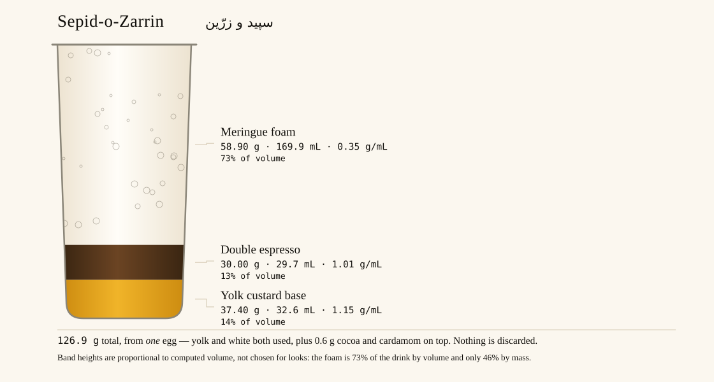
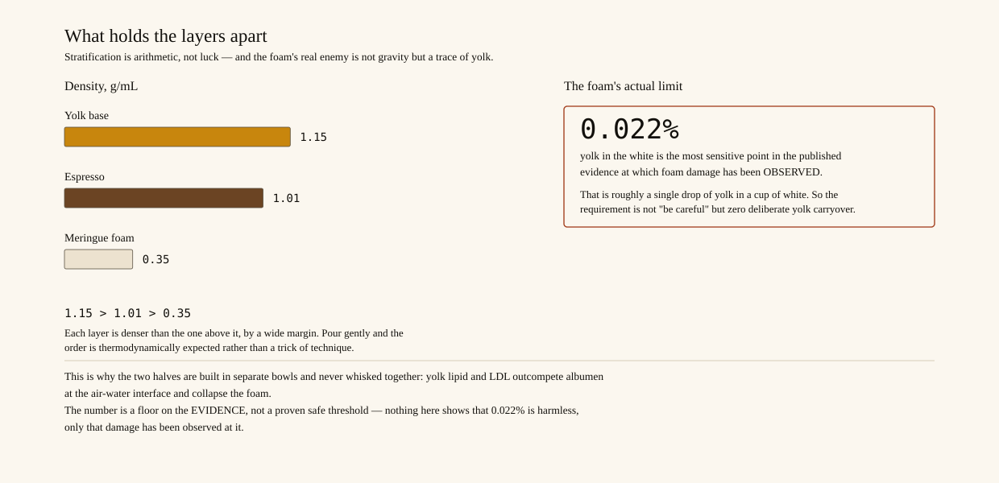
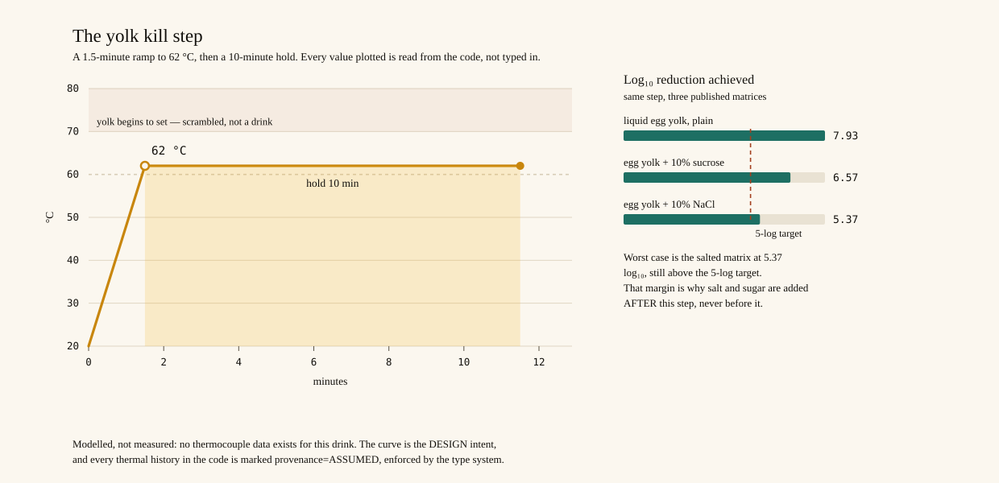
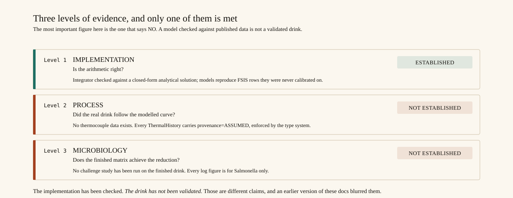
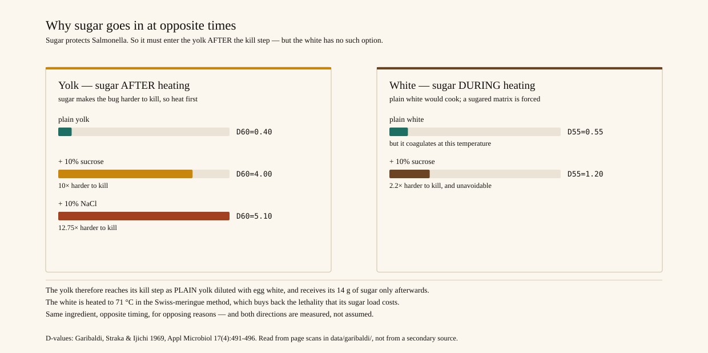

# Sepid-o-Zarrin — سپید و زرّین

*"White and golden"* — the two layers, named for what they are.

A whole-egg espresso drink, designed from food-chemistry first
principles and checked against published regulatory and peer-reviewed
data.

<details>
<summary><b>The name, and why the earlier one was retired</b></summary>

**سپید** *sepid* — "white". The early-classical form of سفید *sefid*
(Wiktionary: *"Early Classical form of سفید"*), so it carries a literary
register rather than the everyday word. It names the meringue layer.

**زرّین** *zarrin* — "golden". From زر *zarr* ("gold") + the adjectival
suffix ـین *-in* (Wiktionary: *"golden"*). It names the yolk custard.

**The retired name was `Sepid-o-Zard`** — سپید و زرد, "white and
yellow". It was withdrawn for two verified reasons:

1. **Cross-linguistic hazard.** While Persian زرد *zard* means "yellow"
   (Middle Persian, cognate with زر *zar*, "gold"), the identical
   spelling in **Arabic** زَرْد *zard* means **"to choke, to strangle"**,
   and in Ottoman Turkish زرد *zerd* means **"strangling, suffocation"**
   (Wiktionary). For a *drink*, that is not a defensible name.
2. **Wrong connotation in Persian too.** زرد also carries the sense of
   *pale* or *sallow* — a sickly complexion — where زرّین is
   unambiguously *golden*.

Candidates checked and **rejected**:

| Candidate | Why rejected |
|---|---|
| دورو *do-ru* ("two-sided") | Wiktionary also gives **"two-faced, hypocritical"** |
| *Zarrin* alone | Trademark collision — a registered mark of Blansh International Inc. (foods), plus Zarrin Ghazal Co. in Iran |
| شیر *shir* | Means "milk", "lion" *and* "faucet" — too ambiguous |

The full phrase *Sepid-o-Zarrin* returned no brand collisions.

</details>

**The problem:** café zabaione and the egg-yolk latte use only the yolk
and discard the white — ~35 g of the best natural foaming agent in a
kitchen. **The solution:** use both, without letting them destroy each
other.

<p align="center">
  
</p>

📄 **[Read the recipe →](docs/RECIPE.md)**
📚 **[Sources →](docs/SOURCES.md)**
⚠️ **[Limitations — what is NOT proven →](docs/LIMITATIONS.md)**

> **Scope of the safety claims.** This project validates a *model*
> against published data. It has **not** run a microbiological challenge
> study on the finished drink. Those are different things, and an earlier
> version of these docs blurred them. Every result now carries an
> explicit evidence grade.

---

## Two findings worth knowing before you read the recipe

### 1. Your current drinks are raw-egg beverages

| Drink | Mixture temp | Salmonella reduction | Required |
|---|---|---|---|
| Zabaione | 51.1 °C | 0.01 log₁₀ | 5.00 |
| Egg-yolk latte | 61.7 °C | 0.74–1.96 log₁₀ | 5.00 |

Espresso reaches the cup at **67 ± 3 °C** (INEI standard) — *not* the
88–95 °C brew temperature. It cannot pasteurize a yolk.

The latte is the more instructive case: it *does* exceed the 61.1 °C
threshold, so a naive "is it hot enough?" check passes it. But FSIS
limits are **time-at-temperature**. The cup only passes *through* that
temperature while cooling. A real hold would need 7.1 minutes.

### 2. One drop of yolk destroys the white's foam

> Foam volume fell from **135 mL to 40 mL** from a single drop of yolk.
> — St. John & Flor 1931

Two independent studies measured foam damage, at very different levels:

| Yolk carryover | In 35 g of white | Source |
|---|---|---|
| **0.022%** | **~8 mg** | Wang & Wang 2009 — significant loss of foaming capacity *and* speed |
| 0.5% | 0.175 g | Li et al. 2021 — significant loss of capacity and stability |

An earlier version of this project encoded 0.5% as "a hard design
limit", which was **23× too lax** and implied anything below it was
fine. Neither figure is a no-effect level, and 8 mg is below what a
kitchen can see or weigh — so the operational rule is **zero deliberate
yolk carryover**, not a tolerance. A tolerance you cannot measure is not
a control.

Yolk LDL out-competes albumen at the air–water interface but can't form
a stable film.

<p align="center">
  
</p>

So the two halves are built **separately** and layered. That constraint
is what gives the drink its architecture.

---

## What's here

```
src/thermal_safety.py    D-z lethality engine + evidence grading
src/formulation.py       recipe model, foam integrity, layering estimates
src/report.py            full report with evidence grades
tests/                   163 tests
data/garibaldi/          primary-source page scans (PMC377728)
docs/RECIPE.md           the practical recipe
docs/SOURCES.md          constants with citations
docs/LIMITATIONS.md      what is NOT proven  <- read this
```

```bash
python3 src/report.py                  # full analysis
python3 tests/test_thermal_safety.py    # 70 tests
python3 tests/test_formulation.py       # 41 tests
python3 tests/test_documented_claims.py # 15 tests
python3 tests/test_claim_surface.py     # 20 tests - reads the PROSE
python3 tests/test_figures.py           # 17 tests - reads the FIGURES
```

---

## How the safety model is validated

The `D-z` thermal-death model is **calibrated by reverse-deriving z and
D from FSIS's own published time/temperature tables**, then checked
against rows it never saw:

| Hold-out check | Predicted | FSIS published |
|---|---|---|
| Egg white, 133 °F | 22.28 min | 22.56 min |
| Egg yolk, 142 °F | 10.48 min | 10.48 min |

It reproduces the regulator's numbers, which is the strongest available
validation. It also independently confirms FSIS's warning that the
superseded 134 °F / 3.5 min egg-white process yields only ~1.3 log₁₀ —
a figure a naive reading of the old rule would get wrong.

## Twelve errors this project caught in itself

Documented rather than quietly patched, because every one of them looked
like success. Some were found by external review; the ones marked 🔎 were
found by **auditing our own work against the primary source.**

A pattern worth stating up front: **every single one of these errors
made the drink look safer than it was.** That is not coincidence —
unverified assumptions drift toward the conclusion you were hoping for.

1. **90 °C espresso.** Assumed the brew temperature was the cup
   temperature. Wrong by ~15 °C — enough to flip a lethality verdict
   from "raw" to "safe." Corrected to the INEI 67 °C standard.

2. **"12020 log₁₀."** The engine extrapolated 14 °C past its calibration
   window and printed a physically meaningless number. Now capped at
   12 log₁₀ with the extrapolation disclosed.

3. **🔴 The sugar-matrix error** — found by external review, and the
   most serious of the three. The project heated a 36.6%-sugar yolk and
   scored it with FSIS's **plain**-yolk model. But sugar *protects* the
   pathogen: Garibaldi 1969 measured yolk D₆₀ rising from **0.40 to 4.0
   min** with just 10% sucrose — a **tenfold** increase in heat
   resistance.

   The fix was a process change, not a better model: **the yolk is now
   pasteurized plain and sweetened afterwards.** The safest fix for a
   modelling problem is a process that doesn't need the model.

4. **🔎 Validity windows read off a figure's *axis*.** Garibaldi's yolk
   TDT curves were recorded as spanning "50–62 °C" — that is the range of
   **Fig. 4's axis**, not of the plotted data. True extents are
   53.0–59.5, 55.0–61.5 and 50.0–62.5 °C.

   So the claim that all three yolk models were "in-window at 62 °C" was
   **false** — and *unachievable*, since the windows intersect only over
   59.4–59.5 °C. A test asserted it and passed, because it was built from
   the same misreading. **An axis range is not a data extent, and a test
   written from the same wrong constants as the claim cannot catch it.**

5. **🔎 Misquoted the source on salt, in the unsafe direction.** A code
   comment said salt has "no protective effect." The paper qualifies
   that: no effect **in a buffer system.** In yolk, D₆₀ rises from 0.40
   to **5.1 min — 12.75×.** Salt is now added after the heat step too.

6. **🔎 Documented figures computed with the wrong ramp.** The
   cross-check table quoted 8.08 / 6.65 / 5.44 log₁₀ — a **4.0 min**
   ramp, while the process uses **1.5 min.** Correct: 7.93 / 6.57 /
   5.37. The drift flattered the design. The ramp is now one named
   constant, and a test recomputes the whole table from it.

7. **🔎 Claimed a regulatory safe harbour that no longer exists.** The
   project called 9 CFR 590.570 Table I *"law, not a model"* and made
   it the yolk step's primary evidence. Verified against the eCFR API:
   the table was **removed on 2022-10-31**. Current §590.570 is a bare
   performance standard.

   A reviewer raised this and was **right in substance but wrong in
   attribution** — they placed the table in §590.575, which was
   actually *"Heat treatment of dried whites"*. Our section citation
   had been correct all along; our *tense* had not. Now graded
   `REGULATORY (historical, superseded)`, a grade that previously
   didn't exist in the enum at all even though the docs printed it.

8. **🔎 Foam threshold 23× too lax.** We encoded 0.5% yolk carryover as
   "a hard design limit". Wang & Wang 2009 measured significant foaming
   loss at **0.022%** — verified from full text. Replaced with both
   evidence points plus a rule: **zero deliberate carryover**, because
   8 mg in 35 g is below kitchen detection.

9. **🔎 `is_defensible` blessed curves nobody measured.** It returned
   `True` for a thermal history labelled *"PURELY ASSUMED, no
   thermocouple"* — reproduced and confirmed. Model correctness and
   process measurement were collapsed into one word, so an aspiration
   inherited a model's credibility. Now three separate properties.

10. **🔎 Retired claims survived *inside the source code*.** After
    error #4 was corrected, the sentence asserting it was still there —
    *"At 62 C all three models are genuinely in-window"* — sitting 80
    lines from its own correction in the same docstring. Two source
    files also disagreed about one physical fact: `formulation.py` said
    the window intersection was 59.4–62.0 °C, `thermal_safety.py` said
    59.4–59.5 °C.

11. **🔎 Fixing an overclaim produced a second overclaim.** When the
    "three models" claim collapsed, its replacement — *"Table I ... is
    a legal safe harbour"* — inherited the original's confidence
    instead of being re-checked. Table I had been superseded for two
    years. **When a claim collapses, its replacement deserves the same
    scrutiny as the original.**

12. **🔎 The foam API contradicted its own documentation.** The docs
    said 0.022% is "not a universal threshold" while the code used it
    as exactly that: a field named `threshold` and a property named
    `foam_will_survive`. Now `most_sensitive_evidence_point` and
    `below_most_sensitive_evidence_point`, and the renderer prints
    **"NO OBSERVED DAMAGE"** rather than "OK" — because below the
    lowest published figure there is no evidence either way, which is
    not the same as fine.

> **Errors 4, 6, 7, 9, 10 and 12 all had passing tests over them** —
> six of twelve. That is why the source scans are committed in
> `data/garibaldi/`, why the regulatory claim is pinned to a
> boundary-tested date, why the integrator is checked against a
> closed-form solution rather than against itself, and why this repo
> now has `tests/test_claim_surface.py`, which reads the source and
> documents as **data** and fails if retired wording reappears.
>
> Every defect found in rounds 3–6 was a *sentence*, not a number, and
> the numeric suites stayed green through all of them.
>
> Building that guard exposed two holes in the guard itself, both found
> by mutation-testing the test:
>
> - **Marker laundering** — text injected *next to* an existing
>   retirement note inherited its protection.
> - **Self-quarantine** — the forbidden phrase *"former regulation safe
>   harbours, still valid"* contains the word "former", which was
>   itself a quarantine marker, so the phrase **excused itself** and a
>   verbatim defect passed.
>
> Both were the same shape as the bug the file exists to prevent: a
> check that looks rigorous while approving its target.

> **One that fixed itself into a new hazard:** moving sugar and salt
> after the kill step solved the matrix problem — and introduced
> recontamination, since 14.2 g of never-heated material now enters
> pasteurized product. See `POST_LETHALITY_CONTROLS`. A fix that
> creates a hazard is still progress, but only if you say so.

---

## Process (modelled, with evidence grades)

<p align="center">
  
</p>

| Step | Process | Result | Evidence |
|---|---|---|---|
| Yolk base | 62 °C / 10 min, **plain** | 7.93 log₁₀, matrix-matched | `MODELLED (in-window)` |
| Yolk base | ″ | would have met the *former* CFR plain-yolk row | `REGULATORY (historical, superseded)` |
| White foam | 71 °C / 3 min, **sweetened** | ≥ 5 log₁₀ | `MODELLED (extrapolated)` ⚠️ |
| ~~White fallback~~ | ~~60 °C / 10 min~~ | **withdrawn** | only 1.3× margin vs ~141× at 71 °C |

### ⚠️ Correction: there is no live regulatory safe harbour here

An earlier version of this README called the yolk step's justification
**"regulatory — law, no window applies"**. That was wrong, and it
overstated the strongest thing this project has. Verified against the
eCFR versioner API, boundary-tested on adjacent dates:

- **9 CFR 590.570 Table I was operative 1971-05-28 to 2022-10-30** and
  was **removed on 2022-10-31** by 85 FR 68680.
- Current §590.570 is a pure **performance standard** — no times, no
  temperatures, no product categories. Its full text is stored in
  `CFR_590_570_CURRENT_TEXT` so you needn't take our word for it.
- The safe harbours didn't vanish; they **moved into the FSIS Food
  Safety Guideline for Egg Products** — which was already this repo's
  model source. FSIS's own words: *"The tables in the appendix ... are
  not minimum lethalities, but rather safe harbors for plants to
  follow."*
- And safe harbours apply to **FSIS-inspected official plants**. A home
  kitchen has none, of any era.

So the historical table is kept as a **benchmark**, not a credential:
it tells us 62 °C / 10 min is a process the regulator once accepted for
plain yolk. That is meaningful context reached independently of our own
arithmetic — and nothing more.

**The finished sweetened base matches no row at all.** After the kill
step we add 14.2 g of sugar and salt to 23.2 g of egg: **38.0% added
nonegg ingredients**, against category caps of <2% and 2–12%. Table I's
own footnote sent unlisted products elsewhere for separate
justification. The benchmark therefore speaks to the **pre-heat egg
phase only**.

### The three levels of evidence

<p align="center">
  
</p>

The two steps do **not** rest on equally strong evidence, and the code
now enforces the distinction rather than promising it in prose:

| Level | Question | Property | Status |
|---|---|---|---|
| 1. Mathematical | Is the model right? | `is_model_defensible` | ✅ **yes** |
| 2. Process | Did the real product follow the modelled curve? | `is_process_measured` | ❌ no thermocouple |
| 3. Microbiological | Does the finished matrix achieve the reduction? | `is_lab_validated` | ❌ no challenge study |

`ThermalHistory` now carries a `provenance` field that defaults to
`ASSUMED` and refuses `MEASURED` unless you name a calibrated
instrument — because a review found `is_defensible` returning `True`
for a curve labelled *"PURELY ASSUMED, no thermocouple"*.

The white step has **no safe harbour, historical or current, and no
published D-value** at 47.5% sugar. It is a modelled extrapolation
stress-tested against a deliberately harsh assumption. It is **not
validated, not laboratory-confirmed, and not a measurement.**

### Hazard scope

Every log₁₀ figure here is for ***Salmonella* and nothing else.**
"5 log₁₀ achieved" must not be read as "all pathogens eliminated".
*Listeria monocytogenes* can be **more** heat resistant than
*Salmonella* in liquid egg white under some conditions (Sampedro et al.
2019, PMID 31195451), and spore-formers are entirely out of scope at
these temperatures.

### The sugar asymmetry

<p align="center">
  
</p>

Sugar enters the two layers at **opposite times**, for opposing reasons:

- **Yolk — sugar AFTER heating.** It would otherwise make *Salmonella*
  ~10× harder to kill.
- **White — sugar DURING heating.** Plain white coagulates at 60 °C
  within minutes (Garibaldi Fig. 5); sugared white doesn't.

So the white must accept a sugared matrix, and compensates with a higher
temperature that survives even a pessimistic sugar-protection
assumption. **That claim is an extrapolation** — our foam is 47.5% sugar
versus the 10% Garibaldi measured. See [`LIMITATIONS.md`](docs/LIMITATIONS.md).

**Salt follows the yolk's rule, not the white's.** It is also added after
heating, for two independently verified reasons: Garibaldi measured D₆₀
rising 0.40 → 5.1 min (12.75×) for yolk + 10% NaCl, and the **former**
9 CFR 590.570 Table I (superseded 2022-10-31) reclassified yolk at ≥2%
salt into a stricter category.

**And the diluent is egg white, not water.** Garibaldi measured its yolk
D-values on yolk "diluted with egg white to approximately 43% egg
solids" — so 5.2 g of the white is diverted into the base, putting the
pan at **43.06% egg solids** and applying the model to the composition it
was actually calibrated on. It comes from the same egg, so nothing extra
is added and nothing is wasted.

## Rejected on purpose

- **Cu²⁺ foam stabilization** — most effective cation in the
  literature; unsafe to dose a drink with copper.
- **Enzymatic lipid hydrolysis** — works (Li et al. 2021), but needs
  pH-stat control and a 2 h incubation. Physical separation is free.
- **Whisking yolk and white together** — exceeds the contamination
  threshold ~3×. The most common way this drink fails.
